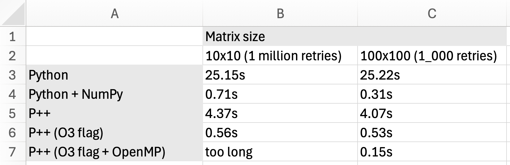

# Phils language v1.0.0

## Info

This program is a Python-like implementation of the C language.

Because it's similar to Python, the entry barrier is low. My goal is to make it as memory-safe as possible, which is something C lacks.

I'm creating this language for specialists working primarily with neural networks. But it can be used anywhere, as it's almost a complete copy of C.

## Tests

```bash
pytest  --verbose
```

## Benchmarks

### Matmul



## Examples

For more information about language syntax fell free to see `./tests` folder

### Imports

```python
cimport "my_header.h" # your module in C
cimport <my_header.h> # system import
import "./module.p" # your module
```

### Input

```python
def main() -> int:
    var name: str = input("Enter your name: ")
    print("Hello, ", name)
    return 0
```

### Cycles

```python
def main() -> int:
    for i in range(0, 10, -1):
        print("i = ", i)
    return 0
```

### C code -> function should starts with @

```python
cimport <math.h>

def main() -> float:
    var a: float = @sqrt(16)   # C code -> function should starts with @
    return a
```

### OOP

```python
class Object:
    def __init__(self, age: int) -> None:
        pass

class User(Object):
    def __init__(self, age: int, a: int) -> None:
        self.age = age
    
    def get_age(self) -> int:
        return self.age


def main() -> int:
    var u: User = User(10, 1)
    print(u.age)

    var age: int = u.get_age()
    print(age)

    return 0
```

```python
class A:
    def get_age_2(self) -> int:
        return 1

class B:
    def get_age(self) -> int:
        return 1
    
    def get_age_1(self) -> int:
        return 10

class User(A, B):
    def __init__(self, age: int, a: int) -> None:
        self.age = age
    
    def get_age(self) -> int:
        return self.age

def main() -> int:
    var u: User = User(10, 1)
    var age: int = u.get_age_2()

    print(age)

    return 0
```

### Pthread (Multiprocessing)

```python
cimport <stdio.h>
cimport <stdlib.h>
cimport <string.h>
cimport <stdbool.h>
cimport <pthread.h>

class Object:
    def __init__(self, a: int):
        self.a = a
    
    def get_a(self) -> int:
        return self.a

def backward_worker(arg: None) -> None:
    var a: Object = arg
    var b: int = a.get_a()
    print(b)
    return None

def main() -> int:
    var thread: pthread_t = None
    var backward_thread_data: Object = Object(100)

    @pthread_create(&thread, NULL, backward_worker, backward_thread_data)
    @pthread_join(thread, NULL)
    return 0
```
